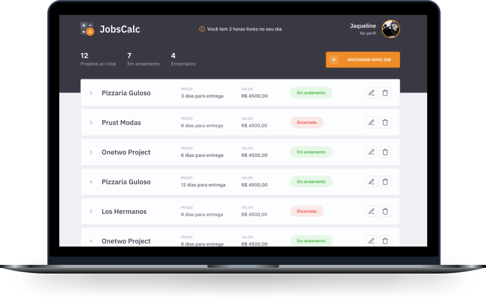
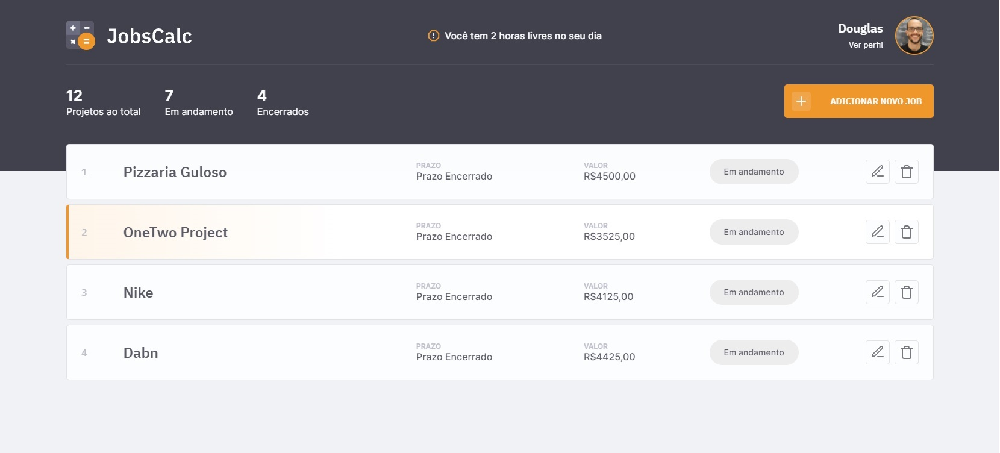

<h1 align="center">
  
</h1>

<p align="center">Calculadora de freelas: valor da hora, orçamento e prazo de cada job.</p>

<p align="center"></p>

## Problema e proposta

Quem trabalha como freelancer costuma cobrar "no chute". O JobsCalc parte da renda mensal desejada, dos dias e horas de trabalho e das férias para calcular o **valor da hora**, e usa esse valor para orçar cada job e mostrar quantas horas livres sobram no dia.

- **Público:** freelancers de desenvolvimento e design.
- **Métrica de sucesso:** jobs orçados por mês (`GET /health` mostra o total).

## Funcionalidades

- Perfil com renda mensal, horas/dia, dias/semana e semanas de férias → valor da hora.
- Jobs com orçamento (R$) e prazo (dias) calculados; status em andamento/encerrado.
- Painel com contagens e horas livres no dia.
- Números com vírgula (`2,5`, `1.234,56`), erros por campo e confirmação acessível ao excluir.
- Proteção opcional por usuário/senha (`APP_USER`/`APP_PASSWORD`) e bloqueio de POST de outra origem.

## Stack

Node 22 · Express 4 · EJS · SQLite (better-sqlite3) · helmet · node:test + supertest.

## Como rodar

```sh
npm install
cp .env.example .env    # opcional
npm run dev             # http://localhost:3000
npm test                # 10 testes
```

Para reaproveitar seus dados antigos, rode uma vez com `DATABASE_FILE=./dbjobscalc.sqlite`: a migration converte os valores para centavos e mantém os jobs.

## Em produção

- **URL:** https://jobs-calc.onrender.com (Render, web service gratuito, blueprint `render.yaml`, deploy automático a cada push na `master`).
- GitHub Pages não serve aqui: o projeto tem servidor Express e banco SQLite, e o Pages só publica arquivos estáticos.
- **`APP_USER` e `APP_PASSWORD` são obrigatórios em produção**: sem eles qualquer pessoa com o link edita os jobs. O Render pede os dois ao criar o serviço.
- O SQLite de produção fica em `/tmp/jobs-calc.sqlite`: perfil e jobs **somem a cada reinício ou deploy**.
- Passo a passo completo (inclui mover `ci/` para `.github/workflows/`): [docs/DEPLOY.md](docs/DEPLOY.md).

## Documentação

[docs/ANALISE.md](docs/ANALISE.md) · [docs/ARQUITETURA.md](docs/ARQUITETURA.md) · [docs/PLANO-DE-ACAO.md](docs/PLANO-DE-ACAO.md) · [docs/DEPLOY.md](docs/DEPLOY.md)

## Licença

MIT — veja [.github/LICENSE.md](.github/LICENSE.md). Projeto da NLW (Rocketseat), evoluído por [@douglasabnovato](https://github.com/douglasabnovato).
