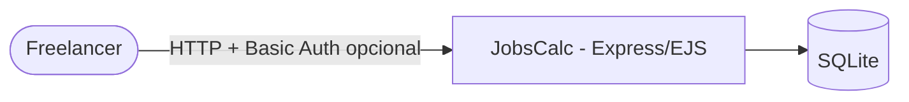
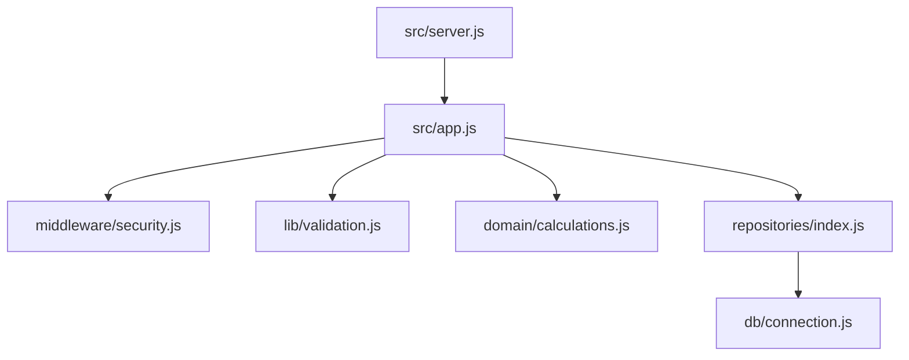

# Arquitetura — JobsCalc

## 1. C4

A regra de negócio (`domain/calculations.js`) é pura: recebe dados e o relógio (`now`) e devolve números. Isso permite testar prazos sem depender da data do computador.

## 2. Modelo de dados

| Tabela | Colunas | Regras |
|---|---|---|
| profile | id (=1), name, avatar, monthly_budget_cents, days_per_week, hours_per_day, vacation_per_year | CHECK de faixas; linha única |
| jobs | id, name, daily_hours REAL, total_hours REAL, created_at (ms) | CHECK nome 2–80, horas > 0 |

`value_hour` deixou de ser armazenado: é **derivado** do perfil (evita inconsistência — 3FN).

## 3. Rotas

| Rota | Resposta |
|---|---|
| `GET /` | Painel |
| `GET/POST /job` | Formulário · 303 · 422 |
| `GET/POST /job/:id` | Edição · 303 · 422 · 404 |
| `POST /job/delete/:id` | 303 · 404 |
| `GET/POST /profile` | Perfil · 303 · 422 |
| `GET /health` | `{ status, jobs }` (sem autenticação) |
| POST de outra origem | 403 |

## 4. ADRs

- **ADR-001 — Consultas preparadas (better-sqlite3).** Fecha a injeção de SQL e elimina a abertura de conexão por chamada.
- **ADR-002 — Dinheiro em centavos inteiros.** Evita erros de ponto flutuante na soma de orçamentos.
- **ADR-003 — Relógio injetado no domínio.** `remainingDays(job, now)` torna prazos testáveis e determinísticos.
- **ADR-004 — Basic Auth opcional + verificação de Origin.** App de uso pessoal: com `APP_USER/APP_PASSWORD` a publicação fica protegida sem criar sistema de contas; a checagem de `Origin` bloqueia CSRF.
- **ADR-005 — Vírgula decimal.** Campos numéricos aceitam `2,5` e `1.234,56` (padrão pt-BR).

## 5. Fora do escopo

Múltiplos usuários, exportar orçamento em PDF, histórico de pagamentos.
